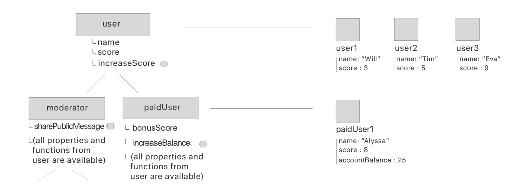

<!-- # Inheritance

Use the above image and implement the Inheritance using all three pattern -->

<!-- 1. Factory pattern -->
var userMethod = {
	incScore(){
		return this.score++
	}
}
var paidUserMethod = {
	incBalance(){
 		return this.balance++
 	}
}

function user(name, score){
    var obj = Object.create(userMethod);
    obj.name = name;
    obj.score = score;
    return obj;
}

function paidUser(balance){
    var obj = Object.create(paidUserMethod);
    obj.balance = balance;
	return obj;
}
Object.setPrototypeOf(paidUserMethod, userMethod);

2. Pseudoclassical Pattern
3. Classes